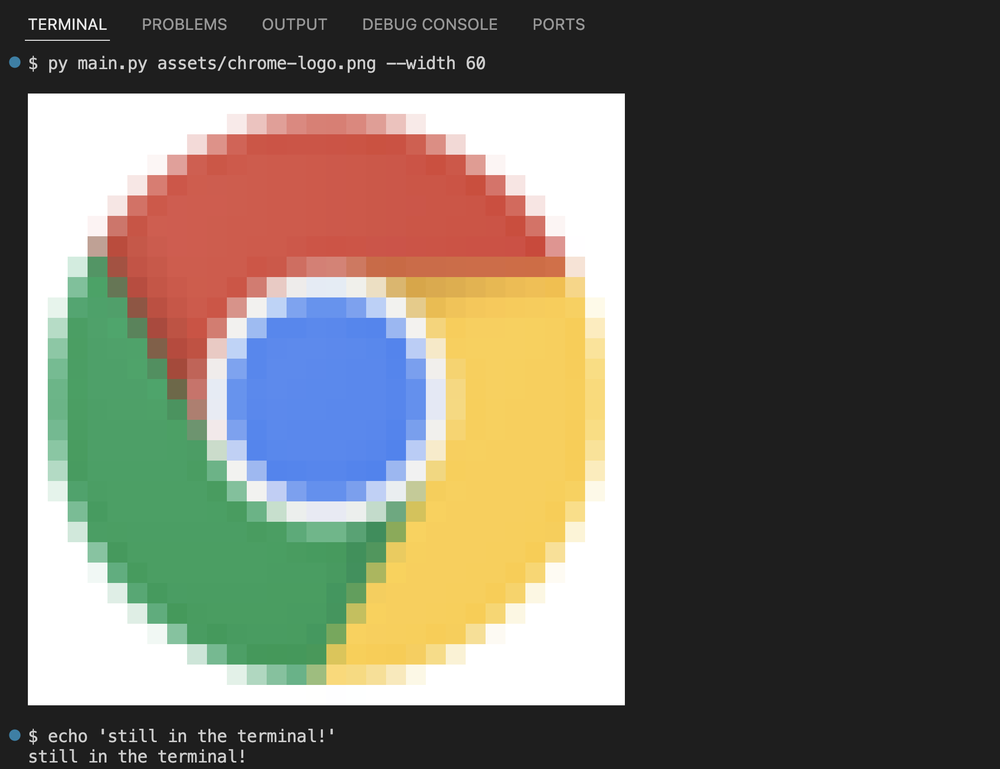

# Terminal Ansi Image

Print images inside your terminal.



You can also pass a URL:


If omitted, the argument `--width` defaults to the size of your terminal.

The code will fallback to [8-bit color palette](https://en.wikipedia.org/wiki/ANSI_escape_code#8-bit) if [true color](https://en.wikipedia.org/wiki/ANSI_escape_code#24-bit) is not supported by your terminal.

## How it Works

The code prints a block of whitespaces, and sets their background color to match the pixels of the image.

```py
def ansi_color(r, g, b):
  return f'\033[48;2;{r};{g};{b}m'

for row in image:
  spaces = (ansi_color(*rgb) + '  ' for rgb in row)
  print(''.join(spaces) + '\033[0m')
```
