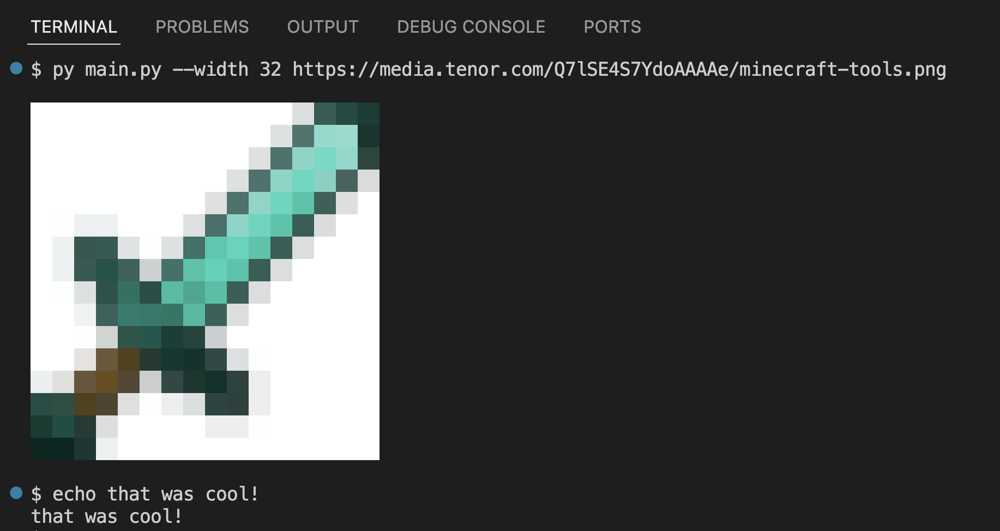
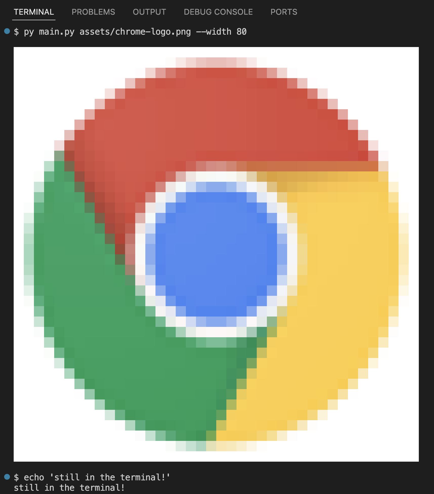

## Terminal Ansi Image

Print images inside your terminal, using ANSI escape codes.

You can pass a *URL*:

... Or a *local path*:

If omitted, the argument `--width` defaults to the size of your terminal.